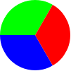
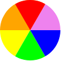
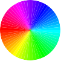

Piirretään sektoreita
=====================

::

    (require 2htdp/image)
    (define SIZE 50)
    (define (make-wedge color angle)
       (underlay/align
        "left" "top"
        (circle SIZE "solid" (make-color 255 255 255 0))
        (crop 0 0 (* 2 SIZE) SIZE
              (cond
                [(< angle 90)
                 (underlay/align "left" "bottom"
                                 (circle SIZE "solid" (make-color 255 255 255 0))
                                 (rotate (- 180 angle)
                                         (crop 0 0 (* 2 SIZE) SIZE
                                               (circle SIZE "solid" color))))]
                [else
                 (underlay/align "left" "top"
                                 (circle SIZE "solid" (make-color 255 255 255 0))
                                 (rotate (- 180 angle)
                                         (crop 0 0 (* 2 SIZE) SIZE
                                               (circle SIZE "solid" color))))]))))

    (overlay
     (rotate 240 (make-wedge "red" 120))
     (rotate 120 (make-wedge "blue" 120))
     (make-wedge "green" 120))

::

    (overlay
     (rotate 300 (make-wedge "red" 60))
     (rotate 240 (make-wedge "violet" 60))
     (rotate 180 (make-wedge "blue" 60))
     (rotate 120 (make-wedge "green" 60))
     (rotate 60 (make-wedge "yellow" 60))
     (make-wedge "orange" 120))

HSL__.

__ https://en.wikipedia.org/wiki/HSL_and_HSV#From_HSL

::

    (define (hue-to-color hue)
      (f1 (/ hue 60)))

    (define (my-modulo a b)
      (cond
        [(< a b) a]
        [else (my-modulo (- a b) b)]))

    (define (f1 H2)
      (f2 H2 (round (* 255 (- 1 (abs (- (my-modulo H2 2) 1)))))))

    (define (f2 H2 X)
      (cond
        [(<= 0 H2 1) (make-color 255 X 0)]
        [(<= 1 H2 2) (make-color X 255 0)]
        [(<= 2 H2 3) (make-color 0 255 X)]
        [(<= 3 H2 4) (make-color 0 X 255)]
        [(<= 4 H2 5) (make-color X 0 255)]
        [(<= 5 H2 6) (make-color 255 0 X)]))

    (define (lots-of-wedges number)
      (make-more-wedges number 0))

    (define (make-more-wedges how-many angle)
      (cond
        [(>= angle 360) (make-wedge "white" 0)]
        [else
         (overlay
          (rotate angle (make-wedge (hue-to-color angle) (/ 360 how-many)))
          (make-more-wedges how-many (+ angle (/ 360 how-many))))]))

    (lots-of-wedges 60)

