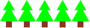
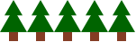

Vakiot
======
Racketissä on mahdollista antaa nimiä eri arvoille.
Tämä vähentää toistoa, jos arvo on laskettu pitkällä ja monimutkaisella
funktiokutsulla.
Se helpottaa myös ohjelman muuttamista: nimetty arvo tarvitsee muuttaa vain kerran,
eikä jokaisessa paikassa, missä sitä käytetään.
Nimeämistä sanotaan :term:`määritelmäksi <määritelmä>` ja
nimettyä arvoa :term:`vakioksi <vakio>`.
Nimi annetaan funktiolla :code:`define`::

    (define nimi arvo)

Esimerkiksi kahden ympyrän kuvalle voi antaa nimen näin::

    (require 2htdp/image)
    (define ympyrät
      (overlay (circle 20 "solid" "red")
               (circle 30 "solid" "blue")))

.. note::

    Määritelmät täytyy kirjoittaa DrRacketin yläosaan!

Kun olet kirjoittanut määritelmän, voit käyttää sitä suoraan alaosassa.
Huomaa, että vakio ei ole funktiokutsu, eli sen eteen ei tule sulkua!
Voit käyttää sitä aivan samaan tapaan kuin kirjoittaisit numeroita,
merkkijonoja tai kopioisit kuvia.
Vakioita voi siis laittaa myös muiden funktioiden syötteeksi,
aivan kuin muitakin arvoja.

Esimerkiksi kuvan metsästä voisi tehdä vaikka näin::

    (require 2htdp/image)
    (define latva
      (overlay/align/offset
       "middle" "top"
       (triangle 20 "solid" "green")
       0 10
       (triangle 30 "solid" "green")))
    latva

    (define runko (rectangle 10 10 "solid" "brown"))
    runko

    (define kuusi
      (above latva runko))
    kuusi

    (define metsä
      (beside kuusi kuusi kuusi kuusi kuusi))
    metsä

Nyt jos vaikka kuusien väriä haluaisi muuttaa,
tarvitsee muutos tehdä vain yhteen paikkaan::

    (define latva
      (overlay/align/offset
       "middle" "top"
       (triangle 20 "solid" "darkgreen")
       0 10
       (triangle 30 "solid" "darkgreen")))

